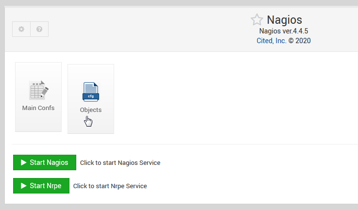

# Nagios Webmin Module

# Info
Nagios Module for Webmin.  Install and Manage Nagios Core and nrpe.

# Install via script:

      wget https://raw.githubusercontent.com/cited/nagios-webmin-module/master/scripts/pre-install.sh
      chmod +x pre-install.sh
      ./pre-install.sh

Go to Servers->Nagios and complete the installtion Wizard.

# Install from GIT
Archive module

$ git clone https://github.com/cited/nagios-webmin-module/

$ mv nagios-webmin-module nagios

$ tar -cvzf nagios.wbm.gz nagios/

Upload from Webmin->Webmin Configuration->Webmin Modules

Go to Servers->Nagios and complete the installtion Wizard.

# Notes

## **Ubuntu**
Tested on Ubuntu 18 and 20 LTS

## **Readhat/Fedora/CentOS**
Tested on CentOS 7x64

## **Issues**
Please report issue here

# Screen Shot

Nagios Module:

Copyright
---------

* Copyright Cited, Inc, 2020
